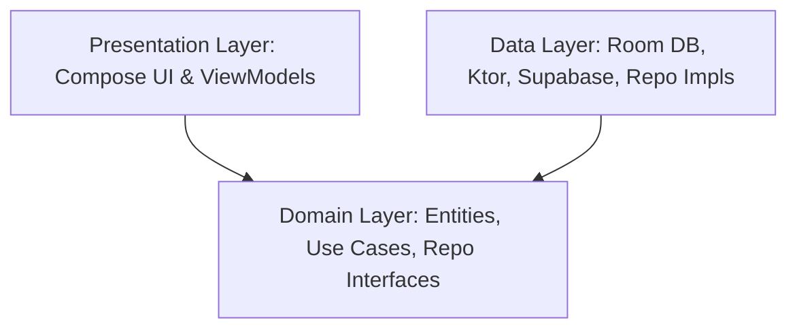

# Clean Architecture in Kotlin Multiplatform (KMP)

This skill directs the agent to strictly enforce Clean Architecture boundaries in a Kotlin Multiplatform project. The project must be partitioned into three logical layers: **Presentation**, **Domain**, and **Data**.



---

## 1. Domain Layer (The Core)
*The domain layer contains all the core business logic, business entities, and repository interfaces. It must be written in **pure Kotlin** and have zero dependencies on Android libraries, serialization libraries, Ktor, Supabase, or databases.*

### Guidelines:
*   **Pure Entities:** Domain models must be pure Kotlin classes. Do not annotate them with database annotations (`@Entity`) or serialization annotations (`@Serializable`).
*   **Use Cases (Interactors):** Single-responsibility classes that execute business logic. They depend purely on Repository interfaces. Define them using the `operator fun invoke` for clean call sites.
*   **Repository Contracts:** Declare repositories as pure Kotlin interfaces inside the domain layer.

### Example (Domain Use Case):
```kotlin
package org.example.project.domain.usecase

import org.example.project.domain.model.Client
import org.example.project.domain.repository.ClientRepository

class GetActiveClientsUseCase(
    private val clientRepository: ClientRepository
) {
    suspend operator fun invoke(): List<Client> {
        return clientRepository.getClients().filter { it.isActive }
    }
}
```

---

## 2. Data Layer (The Infrastructure)
*The data layer handles database persistence, networking, Supabase connectivity, key-value preferences, and implements the repository interfaces defined in the domain layer.*

### Guidelines:
*   **Implement Domain Contracts:** Concrete repository implementations live here (e.g., `ClientRepositoryImpl`).
*   **Data Transfer Objects (DTOs):** Network responses and database tables must be defined as distinct classes (DTOs) with annotations (like `@Serializable` or `@Entity`).
*   **Mapper Pattern:** Always map DTOs to pure Domain Entities using a mapper function before passing the results to the Domain layer. Never return DTOs directly to Domain Use Cases or ViewModels.

### Example (Data Repository with Mapper):
```kotlin
package org.example.project.data.repository

import org.example.project.data.model.ClientDto
import org.example.project.data.model.toDomain // Extension mapper function
import org.example.project.domain.model.Client
import org.example.project.domain.repository.ClientRepository
import io.github.jan.supabase.postgrest.Postgrest

class ClientRepositoryImpl(
    private val postgrest: Postgrest
) : ClientRepository {
    override suspend fun getClients(): List<Client> {
        val dtos = postgrest["Client"].select().decodeList<ClientDto>()
        return dtos.map { it.toDomain() }
    }
}
```

---

## 3. Presentation Layer (The Interface)
*The presentation layer handles rendering the UI using Compose Multiplatform and manages view state via ViewModels.*

### Guidelines:
*   **State Translation:** ViewModels depend purely on Use Cases. They retrieve domain entities, map them to specific UI state models (often inside a `sealed class` representing Loading, Success, or Error), and expose them as a `StateFlow`.
*   **Stateless Composable UI:** Composable functions must observe the UI state and forward UI events (like button clicks) upward.

---

## Core Constraints and Anti-Patterns
*   ❌ **No Leakage:** Never import DTOs or network models into Use Cases or ViewModels.
*   ❌ **No Direct Injection:** Never instantiate Ktor clients, DB databases, or Supabase endpoints directly in ViewModels.
*   ❌ **No Domain Serialization:** Avoid applying `@Serializable` to domain entities. Keep serialization strictly in the Data layer DTOs.
