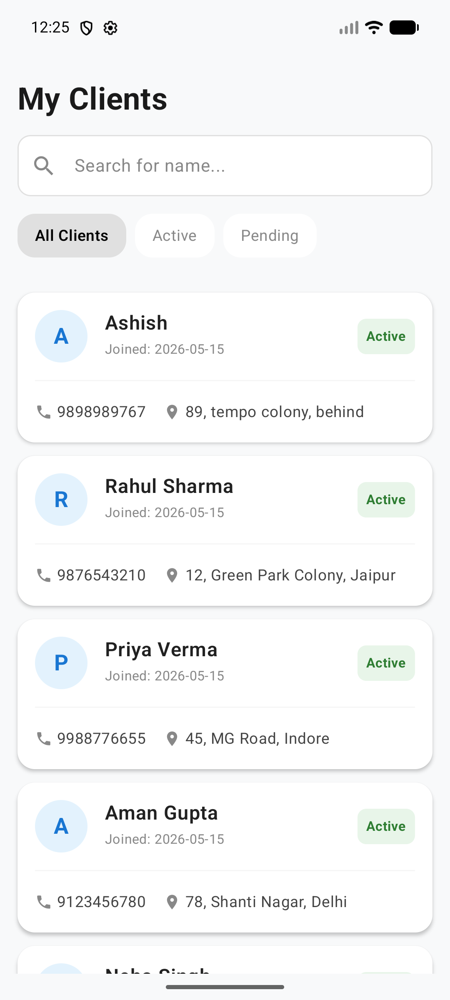
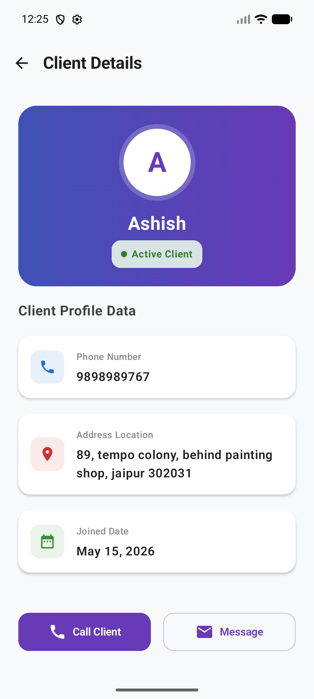
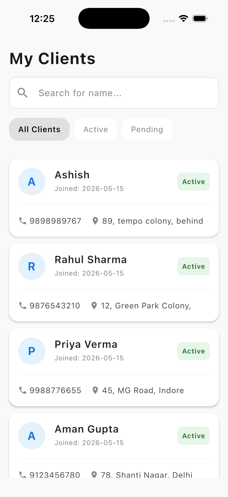
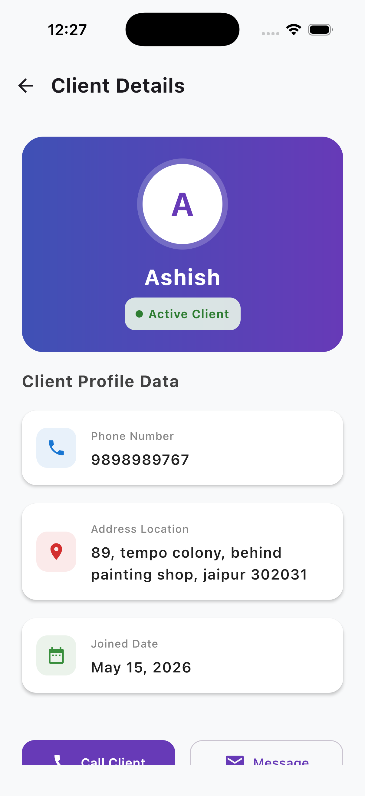
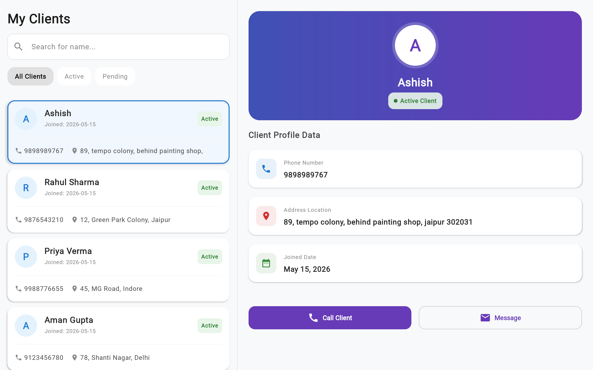
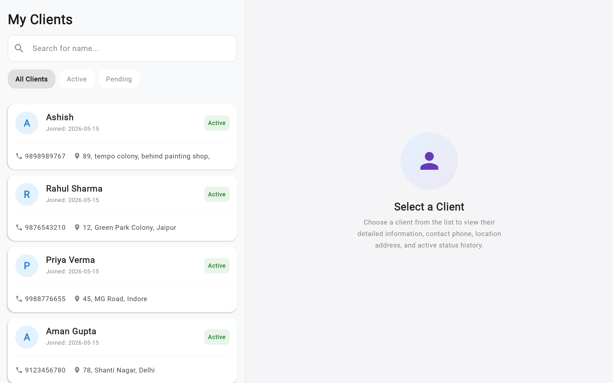

This is a Kotlin Multiplatform project targeting Android, iOS, Web.

* [/iosApp](./iosApp/iosApp) contains an iOS application. Even if you’re sharing your UI with Compose Multiplatform,
  you need this entry point for your iOS app. This is also where you should add SwiftUI code for your project.

* [/shared](./shared/src) is for code that will be shared across your Compose Multiplatform applications.
  It contains several subfolders:
  - [commonMain](./shared/src/commonMain/kotlin) is for code that’s common for all targets.
  - Other folders are for Kotlin code that will be compiled for only the platform indicated in the folder name.
    For example, if you want to use Apple’s CoreCrypto for the iOS part of your Kotlin app,
    the [iosMain](./shared/src/iosMain/kotlin) folder would be the right place for such calls.
    Similarly, if you want to edit the Desktop (JVM) specific part, the [jvmMain](./shared/src/jvmMain/kotlin)
    folder is the appropriate location.

---

# 🚀 Premium Cross-Platform Showcase & Technology Stack

This application is built with **Compose Multiplatform (CMP)** and **Kotlin Multiplatform (KMP)**, target-compiling natively to Android, iOS, and Web target runtimes. The UI and architectural patterns follow modern premium standards, leveraging adaptive layout rules to ensure a flawless experience across all screen sizes and device aspect ratios.

## 🛠️ Technology Stack & Architecture

- **Language & Core:** Kotlin 2.0.x multiplatform compilation.
- **UI Framework:** Compose Multiplatform (CMP) by JetBrains with standard Canvas/Skiko layout engine for highly efficient hardware-accelerated 2D UI rendering on iOS and Web.
- **Design System:** Material Design 3 (M3) utilizing modern design cues such as dynamic gradients, rounded cards, sleek glassmorphism empty-state containers, and harmonized color palettes.
- **Adaptive Layouts:** Dynamic screen partitioning based on layout constraints (e.g., width thresholds $> 720\text{dp}$) to serve both high-productivity desktop dual-pane configurations and standard mobile single-pane stacks.
- **State Management & Navigation:** Clean Architecture utilizing a stateful, fully observable, reactive Navigation Backstack built from Compose's reactive primitive `mutableStateListOf<Screen>()`.

---

## 📸 Cross-Platform Live Screenshots

All screenshots below represent the **real, live application** compiled and executed on target platforms.

### 🤖 Android Native Showcase
Compiled natively and captured on an Android Pixel emulator.

| Client List View | Client Details View |
|:---:|:---:|
|  |  |

---

### 🍎 iOS Native Showcase
Compiled natively via Xcode & Kotlin/Native compiler, and captured on an iOS Simulator.

| Client List View | Client Details View |
|:---:|:---:|
|  |  |

---

### 🌐 Web Browser Showcase (Responsive & Adaptive)
Built via Compose Multiplatform for Web (Canvas WebGL rendering) and run locally.

#### 🖥️ Desktop & Large Screen Viewports (Width > 720dp)
A premium **Dual-Pane Split-Screen Layout** automatically activates on Web browsers:
1. **Initial State (No client selected)**: Left pane displays the client list, and the right pane shows a sleek welcoming empty state description.
2. **Detail State (Client selected)**: Left pane displays the client list with selected item highlighting, and the right pane displays the active client's comprehensive details.

| Dual-Pane Split-Screen View (Detail Selected) | Welcoming Empty State View |
|:---:|:---:|
|  |  |

---

## 🏗️ How to Run the Build and Tests

### 🏃 Running the apps

Use the run configurations provided by the run widget in your IDE's toolbar. You can also use these commands and options:

- **Android app:** `./gradlew :androidApp:assembleDebug`
- **Web app:**
  - Wasm target (faster, modern browsers): `./gradlew :webApp:wasmJsBrowserDevelopmentRun`
  - JS target (slower, supports older browsers): `./gradlew :webApp:jsBrowserDevelopmentRun`
- **iOS app:** Open the [/iosApp](./iosApp) directory in Xcode and run it from there.

### 🧪 Running tests

Use the run button in your IDE's editor gutter, or run tests using Gradle tasks:

- **Android tests:** `./gradlew :shared:testAndroidHostTest`
- **Web tests:**
  - Wasm target: `./gradlew :shared:wasmJsTest`
  - JS target: `./gradlew :shared:jsTest`
- **iOS tests:** `./gradlew :shared:iosSimulatorArm64Test`